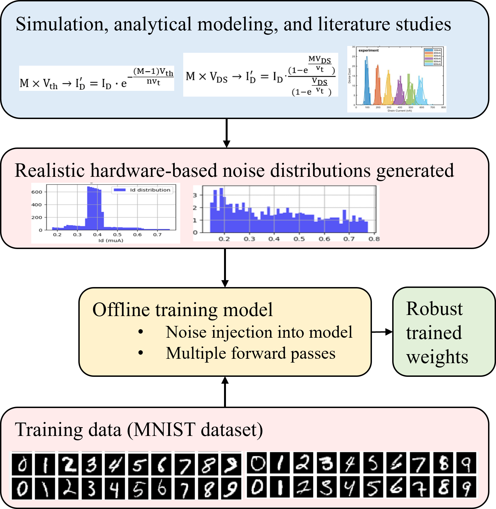

The files in this repository are associated with the paper "Hardware-Aware Offline Training of CTT-Based Neuromorphic Hardware".
For inquiries, contact: zahra.mohammadrezaee@mail.mcgill.ca

The [Binary classifier](TVLSI26/Binary_MNIST_noise_aware.ipynb) framework's full functionality, using [noise model](TVLSI26/ctt_weights/noisePool.py), can be described by:

  

Neuron models:
  1. [digLIF](TVLSI26/neuron_models/digLIF.py) A neuron model that exactly matches the digital LIF neuron in the neuromorphic hardware described in this paper." With constants that replicate our Cadence hardware simulations. 
  2. A more general LIF neuron model that could represent other implementations. This was adopted to show the generalizability of the hardware-aware training approach. A variety of LIF implementations exist, and our results showed that LIF neuron hardware implementations require some flexibility in setting the threshold voltage and decay rate to be used for different tasks. Learning would be much easier the closer we get to actual software-based neural networks with many tunable parameters. Otherwise, acquiring an equivalent performance to ANNs requires a lot more architecture exploration.

Noise injection methodologies:
  1. [Noise pool generation](TVLSI26/ctt_weights/noisePool.py): sweeps different hardware-related parameters such as temperature, PVT changes, and programming imprecision (based on their unique distribution). Then, it creates an array with all the possible values for different network parameters (representing hardware components).
     [Example variations in the drain current of CTTs based on hardware non-idealities](TVLSI26/ctt_weights/ctt_weight_variations.png). This also includes the formulas used to calculatethe effects of different noisy hardware parameters on the drain current (I_D).
  3. [Sensitivity-based model](TVLSI26/ctt_weights/sensitivity_based_noise_calculation.py): based on analytical calculations of combining the effects of variation in multiple parameters (weights, neuron constants) on the parameter of interest. It first samples a value from a pre-defined distribution for each hardware-based variant and then calculates their combined effect.
An autograd-based version has also been provided, which is more generalizable and eliminates the need for manual differentiation.

Cadence simulations:
  - [OCEAN script generation](TVLSI26/hardware_input_output/generating_Cadence_inputs.ipynb): the duration of each pulse (when it is high) is 4ns, however, a 16ns idle time was considered in hadware between multiple pulses. Since the number of considered pulses for the binary classifiers was 16, the whole duration of the simulation was 336ns. The **hardwareImage** function converts the number of pulses at each input to a delay value. In Cadence, this delay value dictates at which time step the input starts sending pulses to the neuron.The **softwareImage** function, does the opposite conversion. A unique OCEAN text is created for each image and they are written one after the other in the OCEAN script to be then uploaded in Cadence so it gives each image to the circuit, records the output, and then moves to the next image.
  - [CSV generation for CTT weights](TVLSI26/hardware_input_output/weights_to_CSV.ipynb): the weights in the network are current values. These values are represented in hardware by the threshold voltage of each device. Therore, each current value (CTT weight) is first converted to its associated threshold voltage and then added to a CSV file.

